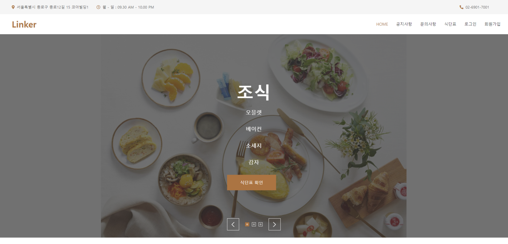
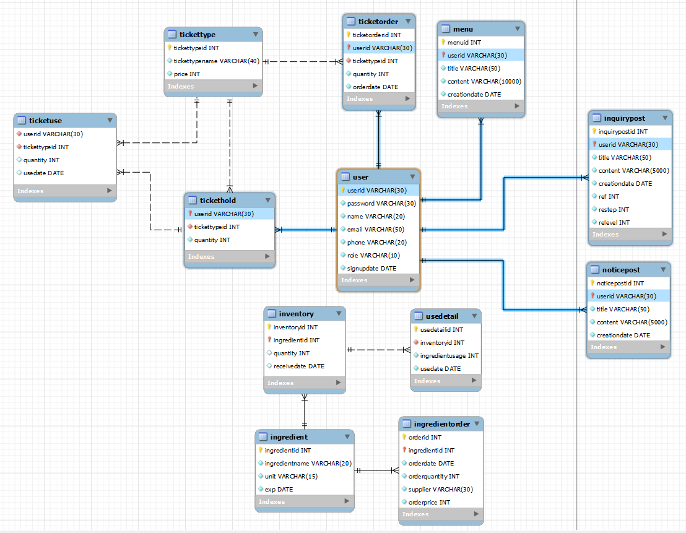

# 식권 구매 및 식자재 관리 시스템


---
## 메인화면


## Table of Contents
- [식권 구매 및 식자재 관리 시스템]
  - [Table of Contents](#table-of-contents)
  - [Introduction](#introduction)
  - [ERD 다이어그램](#erd-다이어그램)
  - [My Role](#my-role)
  - [Prerequisite](#prerequisite)
  - [Development](#development)
    - [Install](#install)
    - [Commit](#commit)
  - [Team](#team)
  - [license](#license)
  - [About](#about)
    
## Introduction
```
linker(soldesk project)
|-- last commit version
|     `-- back
|		`-- bin
|		`-- resources
|		`-- src
|     `-- front
|		`-- webapp
|--
```

## ERD 다이어그램


##  My Role
```
프로젝트 기획
ERD & 데이터베이스 설계
로그인 & 회원가입 유효성 검사 작성
게시판 날짜별 필터링 페이징 구현
css 구현
모든 페이지 디버깅 처리
```

## Prerequisite
Most team members have no prior coding experience.<br/>
Therefore, we used only the skills and code languages we had learned over the previous three months from academy to test our knowledges.
- [Eclipse](https://www.eclipse.org/downloads/): We use Eclipse and its addon(aka Spring Tool Suite 4) to complete the project.
  
## Development
### Install
```bash
$ git clone https://github.com/ychmath/linker.git
```

### Commit
Each member has their own branches and worked on the functions that assigned.<br/>
The members can't directly merge the code to main. <br/>
The members should do pull request and only the code that are reviewed by three people or a creator can merge into main.
```bash
$ git pull
$ git commit -m "commit_description"
$ git push
```

## Team
- 윤장호
- 나유림
- 범주현
- 하승재
- 김태균

## license
- [HTML Codex](./TEMPLATE_LICENSE)
- [MIT license](./LICENSE)
## About
Authored and maintained by **linker**
